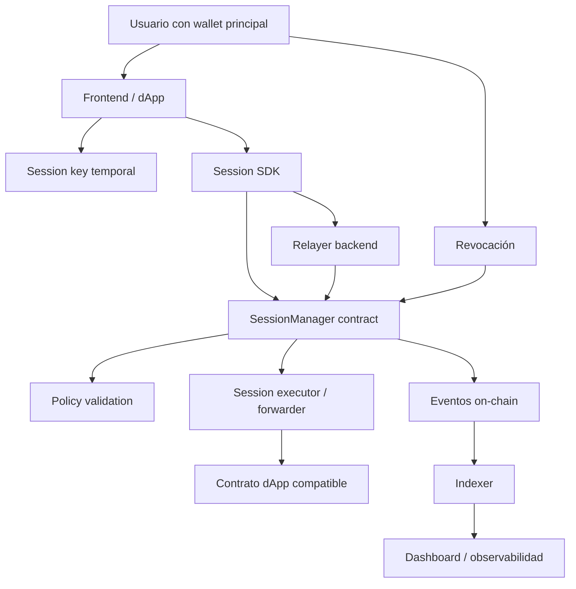

# A. Visión general

## Qué problema resuelve

`SessionKey Kit for Monad` resuelve uno de los mayores problemas de UX en dApps de alta frecuencia: **la necesidad de firmar cada acción con la wallet principal**.

En una app de gaming, trading, social, micropagos o consumer, pedir una firma por cada movimiento, like, trade pequeño o pago destruye la experiencia. Las session keys permiten que el usuario firme **una autorización inicial limitada**, y después una clave temporal pueda ejecutar acciones dentro de límites estrictos.

Ejemplo:

> “Autorizo esta session key durante 10 minutos para interactuar solo con este contrato de juego, máximo 100 acciones, sin transferir más de 0.1 MON.”

Después de eso, la app puede enviar acciones on-chain sin abrir Metamask o la wallet en cada interacción.

---

## Por qué es importante

Este patrón permite construir dApps con experiencia cercana a Web2, pero manteniendo garantías on-chain:

- Menos fricción.
- Más acciones on-chain.
- Mejor UX para juegos y apps sociales.
- Mejor viabilidad para micropagos.
- Control granular de permisos.
- Revocación inmediata.
- Auditoría completa de actividad.

La clave es que **la session key no reemplaza a la wallet principal**. Es una autorización temporal, limitada y revocable.

---

## Por qué Monad es una buena plataforma

Monad es especialmente adecuada porque el valor de las session keys crece cuando la cadena permite muchas acciones rápidas y baratas.

En una EVM lenta o costosa, no tiene sentido hacer cada movimiento, pago pequeño o interacción social on-chain. En Monad sí tiene sentido porque el diseño está orientado a:

- Alto throughput.
- Baja latencia.
- Costes bajos.
- Compatibilidad con EVM.
- Uso de Solidity, Foundry, OpenZeppelin, wallets y tooling Ethereum.

La tesis técnica sería:

> Monad permite que las dApps hagan muchas acciones on-chain; las session keys permiten que esas acciones sean usables.

---

# B. Arquitectura propuesta

## Recomendación principal

Para este proyecto, yo diseñaría la arquitectura en dos niveles:

| Nivel | Objetivo | Recomendación |
|---|---|---|
| MVP hackathon | Demo funcional, seguro y simple | `SessionManager` + relayer + EIP-712 + contrato demo compatible |
| Versión intermedia | Kit reusable para dApps reales | `SessionManager` + ERC-2771-style forwarder + SDK + indexer + policy modules |

La mejor ruta para hackathon no es empezar con account abstraction completa. Es demasiado grande. Lo más sensato es:

1. Usuario firma una autorización EIP-712.
2. Se registra una sesión on-chain.
3. La session key firma acciones localmente.
4. Un relayer envía transacciones a Monad.
5. Un contrato valida permisos, nonce, expiración y límites.
6. El contrato ejecuta llamadas hacia dApps compatibles.

---

## Arquitectura general



---

## Componentes principales

| Componente | Responsabilidad | MVP | Versión intermedia |
|---|---|---:|---:|
| `SessionManager` | Registrar, validar, revocar y ejecutar sesiones | Sí | Sí |
| `PolicyValidator` | Validar permisos por contrato, función, monto y límites | Simple | Modular |
| `SessionForwarder` | Reenviar llamadas a dApps compatibles | Básico | ERC-2771-style |
| `SessionAccount` | Smart account opcional con session keys nativas | No | Sí |
| Relayer | Enviar transacciones sin que el usuario pague o firme cada vez | Sí | Sí |
| SDK TypeScript | Crear sesiones, firmar acciones, llamar al relayer | Básico | Sí |
| Frontend demo | Mostrar UX sin firmas repetidas | Sí | Sí |
| Indexer | Leer eventos, trazabilidad y monitoreo | No o simple | Sí |
| Dashboard | Ver sesiones, acciones, revocaciones y errores | Básico | Sí |
| Monitoring | Alertas, métricas, relayer health, abuso | No | Sí |

---

## Modelo conceptual de permisos

Una sesión debería estar definida por una política como esta:

```solidity
struct SessionPolicy {
    address owner;
    address sessionKey;
    uint48 validAfter;
    uint48 validUntil;
    uint32 maxCalls;
    uint32 maxCallsPerWindow;
    uint32 windowSeconds;
    uint96 maxNativeSpend;
    bytes32 salt;
    Permission[] permissions;
}

struct Permission {
    address target;
    bytes4 selector;
    uint96 maxValuePerCall;
    bytes32 constraintHash;
}
```

Y cada acción ejecutada por la session key debería comprometerse con algo como:

```solidity
struct SessionCall {
    bytes32 sessionId;
    uint64 nonce;
    address target;
    uint256 value;
    bytes32 callDataHash;
    uint48 deadline;
}
```

La idea es que:

- La wallet principal firma la creación de la sesión.
- La session key firma cada acción.
- El contrato valida que esa acción cumple la política original.

---

## Modos de integración

### 1. Modo MVP: contrato de permisos personalizado

La dApp integra directamente con `SessionManager`.

Ejemplo:

```solidity
sessionManager.executeWithSession(policy, call, callData, sessionKeySignature);
```

Ventajas:

- Simple.
- Rápido de construir.
- Fácil de auditar.
- Muy adecuado para hackathon.
- Bajo coste relativo.

Desventajas:

- No sirve automáticamente para cualquier contrato existente.
- Las dApps deben integrarlo explícitamente.
- Hay que diseñar bien cómo se interpreta `msg.sender`.

Recomendación:

> Usarlo en el MVP.

---

### 2. Modo ERC-2771-style trusted forwarder

La dApp soporta un forwarder confiable. El contrato receptor usa algo similar a `ERC2771Context` de OpenZeppelin para recuperar el usuario original.

Ventajas:

- Estándar conocido.
- Buena UX.
- Permite meta-transactions.
- Las dApps pueden seguir usando `_msgSender()` en lugar de `msg.sender`.

Desventajas:

- El contrato destino debe estar diseñado para soportarlo.
- Si una dApp usa directamente `msg.sender`, puede romperse.
- El forwarder se vuelve una pieza crítica.

Recomendación:

> Muy buena opción para versión intermedia y para dApps que se construyan específicamente sobre Monad.

---


## Evaluación de decisiones de diseño

| Decisión | Ventajas | Desventajas | Encaje con Monad | Recomendación |
|---|---|---|---|---|
| Contratos de permisos personalizados | Simples, baratos, auditables | Menos compatibilidad universal | Muy buen encaje para MVP | Sí, base inicial |
| Relayers | UX sin gas ni firmas constantes | Centralización, DoS, gestión de claves | Muy útil por baja latencia | Sí |
| Meta-transactions | Usuario firma, relayer ejecuta | Requiere protección contra replay | Excelente para consumer apps | Sí |
| EIP-712 | Firmas legibles y seguras | Hay que diseñar bien los domains | Imprescindible | Sí, obligatorio |
| ERC-2771 | Estándar para trusted forwarders | Requiere soporte en destino | Bueno para dApps nuevas en Monad | Sí, versión intermedia |
| Smart accounts | Más general y potente | Más complejo y caro | Bueno a medio plazo | No para MVP corto |
| Session permissions | Control granular | Riesgo de mala configuración | Es el núcleo del producto | Sí |
| AA parcial | Balance entre UX y complejidad | Todavía requiere contratos de cuenta | Muy buena ruta futura | Sí, después del MVP |
| AA completa | UX avanzada | Complejidad alta | Depende del ecosistema | No inicialmente |
| Claves temporales | UX excelente | Riesgo si se comprometen | Muy buen encaje | Sí, con límites estrictos |
| Validación on-chain | Seguridad fuerte | Más gas | En Monad tiene mucho sentido | Sí para límites críticos |
| Validación off-chain | Reduce fallos y latencia percibida | No es suficiente para seguridad | Útil como preflight | Sí, pero no como única defensa |

---

# C. Flujo técnico completo

## 1. Creación de sesión

### Paso 1: generación de session key

El frontend genera una clave temporal secp256k1.

En MVP:

- Generada en el navegador.
- Guardada en memoria o `sessionStorage`.
- Expira rápido.
- Nunca se envía al backend.

En producción:

- Idealmente cifrada localmente.
- Integrable con passkeys, secure enclave o wallet embebida.
- Revocable on-chain.

---

### Paso 2: construcción de la política

La dApp construye una política clara:

```text
Owner: 0xUser
Session key: 0xSessionKey
Contrato permitido: 0xGameContract
Funciones permitidas: move(uint8), attack(uint256)
Duración: 10 minutos
Máximo de llamadas: 100
Máximo valor nativo: 0
Rate limit: 20 llamadas por minuto
```

---

### Paso 3: autorización del usuario

El usuario firma un mensaje EIP-712 con su wallet principal.

La firma debería comprometerse con:

- `chainId`.
- `verifyingContract`.
- `owner`.
- `sessionKey`.
- `validAfter`.
- `validUntil`.
- `maxCalls`.
- `spendLimits`.
- `policyHash`.
- `salt`.
- `ownerNonce`.

Esto evita replay entre:

- diferentes cadenas,
- diferentes contratos,
- diferentes sesiones,
- diferentes usuarios.

---

### Paso 4: registro on-chain

El frontend o relayer llama:

```solidity
createSession(policy, ownerSignature)
```

El contrato:

1. Verifica la firma EIP-712 del owner.
2. Calcula `sessionId`.
3. Verifica que el nonce del owner no fue usado.
4. Guarda el estado mínimo de la sesión.
5. Emite `SessionCreated`.

Ejemplo de estado mínimo:

```solidity
struct SessionState {
    address owner;
    bytes32 policyHash;
    uint64 nonce;
    uint32 callCount;
    uint48 windowStart;
    uint32 windowCallCount;
    uint96 nativeSpent;
    bool revoked;
}
```

Importante: no hace falta guardar toda la política en storage. Se puede guardar solo `policyHash` y pasar la política en calldata durante la ejecución.

---

## 2. Autorización del usuario

La autorización debe ser legible para humanos.

El modal no debería decir solamente:

> “Sign typed data.”

Debería decir:

```text
Autorizar sesión temporal

App: Monad Racer
Duración: 10 minutos
Acciones permitidas:
- move(uint8)
- collectItem(uint256)

Límites:
- Máximo 100 acciones
- Sin transferencias de MON
- Solo contrato 0x123...
- Revocable en cualquier momento
```

Esta capa de UX es crítica. Muchas vulnerabilidades en session keys no vienen de Solidity, sino de usuarios autorizando permisos demasiado amplios.

---

## 3. Emisión de permisos

Después de `createSession`, se emite:

```solidity
event SessionCreated(
    bytes32 indexed sessionId,
    address indexed owner,
    address indexed sessionKey,
    bytes32 policyHash,
    uint48 validUntil
);
```

El SDK guarda:

- `sessionId`.
- `sessionKey`.
- `policy`.
- `validUntil`.
- `currentNonce`.
- endpoint del relayer.

---

## 4. Ejecución de acciones

Cuando el usuario hace una acción dentro de la dApp:

```text
Click "move right"
```

El SDK:

1. Construye el calldata.
2. Calcula `callDataHash`.
3. Crea un `SessionCall`.
4. Lo firma con la session key.
5. Envía todo al relayer.

Ejemplo:

```typescript
{
  sessionId,
  nonce: 7,
  target: gameContract,
  value: 0,
  callDataHash,
  deadline: now + 30 seconds
}
```

El relayer envía:

```solidity
executeWithSession(policy, sessionCall, callData, sessionSignature)
```

---

## 5. Validación on-chain

El contrato debe validar, en este orden aproximado:

1. La sesión existe.
2. `policyHash` coincide.
3. La sesión no está revocada.
4. `block.timestamp >= validAfter`.
5. `block.timestamp <= validUntil`.
6. El `deadline` de la acción no expiró.
7. La firma pertenece a `sessionKey`.
8. El `nonce` es correcto.
9. El target está permitido.
10. El selector está permitido.
11. El `value` no excede límites.
12. El número de llamadas no excede `maxCalls`.
13. El rate limit no se excede.
14. El gasto acumulado no supera límites.
15. Las constraints específicas de calldata se cumplen.

Después:

1. Actualiza nonce y contadores.
2. Ejecuta la llamada.
3. Emite evento.

---

## 6. Expiración

La expiración debe ser validada on-chain con `block.timestamp`.

Reglas recomendadas:

- `validAfter` opcional para sesiones programadas.
- `validUntil` obligatorio.
- TTL máximo por defecto en el SDK.
- Para MVP: máximo recomendado de 5 a 30 minutos.
- Para producción: permitir políticas más largas, pero con límites más estrictos.

Una sesión expirada no necesita ser eliminada inmediatamente. Puede quedar como historial. La limpieza puede hacerse luego si se quiere recuperar storage, aunque en EVM normalmente no conviene complicar el MVP con eso.

---

## 7. Revocación

La revocación debe ser inmediata y on-chain.

Funciones recomendadas:

```solidity
function revokeSession(bytes32 sessionId) external;

function revokeSessionWithSig(
    bytes32 sessionId,
    uint256 ownerNonce,
    bytes calldata ownerSignature
) external;
```

La primera la llama el owner directamente.

La segunda permite revocar vía relayer, útil si el usuario no quiere pagar gas o está usando una UX gasless.

Evento:

```solidity
event SessionRevoked(
    bytes32 indexed sessionId,
    address indexed owner,
    address revokedBy
);
```

Regla crítica:

> Cada ejecución debe consultar `revoked == false`.

No usar un modelo completamente stateless si se requiere revocación inmediata.

---

## 8. Manejo de errores y ataques

Ejemplos de errores:

| Error | Respuesta |
|---|---|
| Firma inválida | Revert con custom error |
| Sesión expirada | Revert |
| Sesión revocada | Revert |
| Nonce usado | Revert |
| Target no permitido | Revert |
| Selector no permitido | Revert |
| Límite excedido | Revert |
| Relayer caído | Permitir fallback a envío directo |
| Session key perdida | Crear nueva sesión |
| Session key comprometida | Revocar inmediatamente |

---

# D. Stack tecnológico recomendado

## Smart contracts

| Tecnología | Recomendación | Por qué | Limitaciones |
|---|---|---|---|
| Solidity | Sí, versión moderna `^0.8.24` o similar | Compatibilidad EVM, tooling maduro | Cuidado con gas y storage |
| OpenZeppelin Contracts | Sí | `ECDSA`, `EIP712`, `ERC2771Context`, utilidades seguras | Algunas abstracciones añaden gas |
| Foundry | Sí, herramienta principal | Tests rápidos, fuzzing, invariants, scripts | Menos amigable para algunos flujos frontend |
| Hardhat | Opcional | Buen ecosistema TypeScript y plugins | No usarlo si duplica complejidad |
| Monad Foundry / templates Monad | Sí, si están disponibles oficialmente | Configuración RPC, chain ID, deploys en Monad | No sustituye auditoría ni tests locales |

Mi recomendación:

> Usar Foundry como base. Añadir Hardhat solo si el equipo ya lo domina o necesita plugins específicos.

---

## Estándares recomendados

| Estándar | Uso |
|---|---|
| EIP-712 | Firmas de autorización y acciones |
| ERC-2771 | Forwarding hacia dApps compatibles |
| EIP-1271 | Soporte futuro para smart accounts |
| ERC-165 | Opcional para detectar interfaces compatibles |

---

## Backend / relayer

Recomendación MVP:

- Node.js.
- TypeScript.
- `viem` o `ethers`.
- Fastify o Express.
- Cola simple en memoria.
- Logs estructurados.

Recomendación intermedia:

- Fastify o NestJS.
- `viem` como cliente principal.
- PostgreSQL para auditoría.
- Redis para rate limiting y colas.
- BullMQ si hay alto volumen.
- OpenTelemetry para trazas.
- Prometheus + Grafana para métricas.

### `viem` vs `ethers`

| Opción | Ventajas | Limitaciones | Recomendación |
|---|---|---|---|
| viem | Type safety, APIs modernas, buen soporte TS | Menos familiar para algunos equipos | Preferido |
| ethers | Muy conocido, documentación amplia | Tipado menos estricto en algunos casos | Buena alternativa |

---

## Frontend

Para hackathon:

- Vite + React.
- Wagmi.
- Viem.
- RainbowKit o wallet connector simple.
- UI propia para permisos.

Para versión intermedia:

- SDK separado.
- Componentes React:
  - `SessionProvider`.
  - `CreateSessionModal`.
  - `SessionStatus`.
  - `RevokeSessionButton`.

---

## Indexación

| Opción | Uso | Recomendación |
|---|---|---|
| Viem log watcher | MVP | Sí |
| Ponder | Indexer TypeScript moderno | Muy buena opción |
| Envio | Indexación rápida multi-chain | Buena alternativa |
| The Graph | Ecosistema conocido | Depende de soporte/red |
| Indexer custom | Máximo control | Más mantenimiento |

Para hackathon, basta con escuchar eventos:

- `SessionCreated`.
- `SessionExecuted`.
- `SessionRevoked`.
- `SessionExpired`, si se emite explícitamente.
- `SessionExecutionFailed`.

---

## Testing

### Foundry unit tests

Casos mínimos:

- Crear sesión válida.
- Rechazar firma inválida.
- Ejecutar acción válida.
- Rechazar target no permitido.
- Rechazar selector no permitido.
- Rechazar sesión expirada.
- Rechazar sesión revocada.
- Rechazar replay de nonce.
- Rechazar exceso de `maxCalls`.
- Rechazar exceso de monto.

### Fuzzing

Fuzz sobre:

- Nonces.
- Timestamps.
- Selectors.
- Targets.
- Values.
- Políticas aleatorias.
- Firmas inválidas.
- Permisos solapados.

### Invariants

Invariantes importantes:

```text
Una sesión revocada nunca puede ejecutar.
Una sesión expirada nunca puede ejecutar.
callCount nunca puede superar maxCalls.
nativeSpent nunca puede superar maxNativeSpend.
Un nonce no puede ejecutarse dos veces.
Una acción no autorizada nunca llega al target.
Una firma no puede reutilizarse en otro chainId.
Una firma no puede reutilizarse en otro contrato verificador.
```

---

## Herramientas de seguridad

| Herramienta | Uso | Limitaciones |
|---|---|---|
| Slither | Análisis estático | Puede dar falsos positivos |
| Aderyn | Auditoría estática moderna | Complementaria |
| Mythril | Análisis simbólico | Puede ser lento |
| Echidna | Fuzzing avanzado | Requiere setup |
| Medusa | Fuzzing/invariants | Más avanzado |
| Halmos | Symbolic testing con Foundry | Curva de aprendizaje |
| Forge coverage | Cobertura | No garantiza seguridad |
| Solhint | Estilo y linting | No detecta bugs complejos |

Para hackathon:

- Foundry tests.
- Fuzz básico.
- Slither.
- Gas snapshots.


---

# E. Seguridad

## Principio central

El relayer, el frontend y el backend **no deben ser confiables para la seguridad**.

Todo permiso crítico debe ser validado on-chain.

El relayer puede mejorar UX, filtrar spam y simular transacciones, pero no debe ser necesario confiar en él para evitar robos o abuso.

---

## Replay protection

### Riesgos

Una firma podría reutilizarse:

- En otra cadena.
- En otro contrato.
- En otra sesión.
- Después de expirar.
- Con otro calldata.
- Por otro relayer.
- Con el mismo nonce.

### Mitigaciones

Usar EIP-712 con domain separado:

```text
name: "MonadSessionKeyKit"
version: "1"
chainId: Monad chain id
verifyingContract: SessionManager address
```

Cada firma de acción debe incluir:

- `sessionId`.
- `nonce`.
- `target`.
- `value`.
- `callDataHash`.
- `deadline`.

El `sessionId` debe incluir:

```text
owner
sessionKey
policyHash
salt
chainId
verifyingContract
```

---

## Nonce management

### Opción 1: nonce secuencial

```solidity
mapping(bytes32 => uint64) public sessionNonce;
```

Ventajas:

- Simple.
- Barato.
- Fácil de razonar.
- Ideal para MVP.

Desventajas:

- Menos paralelismo por sesión.
- Si dos acciones se envían al mismo tiempo, una puede fallar.
- Puede crear fricción en juegos de alta frecuencia.

Recomendación:

> Usar nonce secuencial en el MVP.

---

### Opción 2: nonce por lanes

```solidity
mapping(bytes32 => mapping(uint8 => uint64)) public laneNonce;
```

Ventajas:

- Permite más concurrencia.
- Útil para diferentes tipos de acciones.
- Mejor para Monad si hay muchas transacciones simultáneas por sesión.

Desventajas:

- Más complejidad.
- Más superficie de error.

Recomendación:

> Buena opción para versión intermedia.

---


---

## Permisos mal configurados

Este es uno de los mayores riesgos.

Ejemplo peligroso:

```text
Permitir cualquier target.
Permitir cualquier selector.
Permitir approve(address,uint256).
Permitir transferFrom.
Duración de 30 días.
Sin límite de monto.
```

Eso equivale casi a entregar la cuenta.

### Mitigaciones

- Políticas restrictivas por defecto.
- Máximo TTL por defecto.
- No permitir wildcard en MVP.
- Mostrar permisos legibles.
- Requerir target explícito.
- Requerir selectors explícitos.
- Desaconsejar `approve`.
- Si se permite `approve`, restringir:
  - spender,
  - token,
  - amount,
  - duración.
- Crear templates seguros:
  - Gaming session.
  - Social session.
  - Micropayment session.
  - Trading session.

---

## Abuso de session keys

### Riesgos

Si la session key se filtra, un atacante puede actuar dentro de sus permisos.

### Mitigaciones

- TTL corto.
- `maxCalls`.
- `maxSpend`.
- Rate limits.
- Target whitelist.
- Selector whitelist.
- Revocación inmediata.
- Alerta de actividad sospechosa.
- Session keys no persistentes por defecto.
- Opción de “panic revoke”.

---

## Revocación

La revocación debe ser:

- On-chain.
- Inmediata.
- Visible.
- Fácil desde la UI.

Funciones recomendadas:

```solidity
revokeSession(sessionId)
revokeAllSessions(owner)
revokeSessionWithSig(sessionId, ownerSig)
```

`revokeAllSessions` puede hacerse con un `globalOwnerNonce` o `sessionEpoch`.

Ejemplo:

```solidity
mapping(address => uint64) public ownerEpoch;
```

Cada sesión incluye `ownerEpoch` al crearse. Si el usuario incrementa su epoch, invalida todas las sesiones anteriores.

Ventaja:

- Revocación masiva barata.

Desventaja:

- Requiere incluir epoch en la validación.

---

## Expiración

Usar `block.timestamp`.

Riesgos:

- Timestamps no son perfectos para precisión de segundos.
- Pero son suficientemente buenos para expiración de sesiones.

Mitigaciones:

- No usar expiraciones críticas de milisegundos.
- Usar márgenes razonables.
- Per-action deadline corto para trading o pagos.
- TTL corto por defecto.

---

## Protección contra spam

Hay dos niveles.

### Nivel relayer

- Rate limit por IP.
- Rate limit por sessionId.
- Rate limit por owner.
- Simulación previa.
- Rechazo de acciones obviamente inválidas.
- Cuotas por app.
- Requerir API key para dApps integradoras.

### Nivel on-chain

- `maxCalls`.
- `maxCallsPerWindow`.
- `windowSeconds`.
- `maxSpend`.
- Nonces.

En Monad, aunque el gas sea bajo, el spam sigue siendo un problema económico y operacional para el relayer.

---

## Riesgos del relayer

El relayer puede:

- Censurar acciones.
- Reordenar acciones.
- No enviar transacciones.
- Quedarse sin fondos.
- Filtrar metadata.
- Ser atacado con spam.
- Enviar acciones válidas pero no deseadas si obtiene firmas.

Pero no debe poder:

- Modificar calldata.
- Cambiar target.
- Cambiar value.
- Saltarse límites.
- Ejecutar después de revocación.
- Ejecutar sin firma de session key.

### Mitigaciones

- Firma de session key compromete calldata.
- Simulación antes de enviar.
- Idempotency keys.
- Deadlines cortos.
- Logs auditables.
- Balance monitoring.
- Fallback para que el usuario pueda enviar directamente.
- Relayer key en vault o KMS para producción.
- No guardar private keys de session en backend.

---

## Límites inseguros

Whitelist por selector no siempre es suficiente.

Ejemplo:

```solidity
approve(address spender, uint256 amount)
```

Permitir solo el selector `approve` sigue siendo peligroso si no restringes `spender` y `amount`.

Para funciones sensibles se necesita validación específica de calldata.

### Solución

Usar validators por tipo de acción.

Ejemplo:

```solidity
interface IActionValidator {
    function validate(
        address owner,
        address target,
        uint256 value,
        bytes calldata callData,
        bytes calldata validatorData
    ) external view returns (bool);
}
```

Para MVP, evitar validators externos y soportar solo:

- target whitelist,
- selector whitelist,
- max value,
- max calls,
- expiry,
- nonce.

Para versión intermedia, añadir validators auditados.

---

## Reentrancy

Riesgo: el target llamado puede intentar reentrar en `SessionManager`.

Mitigaciones:

- Checks-effects-interactions.
- Actualizar nonce y contadores antes de la llamada externa.
- `nonReentrant` si el diseño lo requiere.
- No permitir `delegatecall`.
- No permitir llamadas arbitrarias en MVP.
- Manejar cuidadosamente llamadas fallidas.

Una buena opción es que `executeWithSession` no haga revert si el target falla, sino que emita un evento de fallo después de consumir nonce. Pero esto tiene tradeoffs:

| Modelo | Ventaja | Desventaja |
|---|---|---|
| Revert completo si target falla | Estado limpio, simple | La misma firma puede reintentarse |
| Consumir nonce aunque target falle | Evita replay de fallos | Más complejo, requiere no revertir |

Para MVP, revert completo es aceptable. Para relayer productivo, consumir nonce en fallos puede ser mejor.

---

# F. Optimización de gas y rendimiento

## Principios

En Monad, el gas será menor y el throughput mayor que en muchas EVMs tradicionales, pero eso no significa que debas ignorar eficiencia.

La estrategia correcta es:

> Usar la capacidad de Monad para validar seguridad on-chain, pero sin crear storage innecesario ni cuellos de botella globales.

---

## Reducir storage writes

Storage es lo más caro.

Recomendaciones:

1. Guardar `policyHash`, no toda la política.
2. Pasar la política en calldata durante ejecución.
3. Guardar solo:
   - owner,
   - policyHash,
   - nonce,
   - counters,
   - spent,
   - revoked.
4. Evitar arrays dinámicos en storage.
5. Evitar mappings anidados complejos en MVP.
6. No guardar historial on-chain; usar eventos.

---

## Estructuras compactas

Usar tipos pequeños cuando tenga sentido:

```solidity
uint48 validUntil;
uint48 validAfter;
uint64 nonce;
uint32 callCount;
uint32 maxCalls;
uint96 spend;
```

Ventaja:

- Mejor packing.
- Menos storage slots.
- Menor gas.

Cuidado:

- No sobre-optimizar antes de tener tests.
- Asegurar rangos suficientes.

---

## Custom errors

Usar:

```solidity
error SessionExpired();
error InvalidNonce();
error UnauthorizedTarget();
error UnauthorizedSelector();
```

En lugar de:

```solidity
require(condition, "Session expired");
```

Reduce gas y mejora claridad.

---

## Minimizar validaciones innecesarias

Orden recomendado:

1. Validaciones baratas primero.
2. Storage reads necesarios.
3. Hashes.
4. Signature recovery.
5. Validaciones de permisos.
6. Writes.
7. External call.

Aunque signature recovery cuesta gas, a veces necesitas validar sesión antes para evitar trabajo innecesario.

---

## Evitar hot storage global

En Monad, una consideración importante es diseñar para alto paralelismo. Aunque los contratos sean EVM-compatible, el rendimiento se beneficia si las transacciones no compiten por las mismas claves de storage.

Evitar:

```solidity
uint256 public globalExecutionCounter;
```

Si cada ejecución escribe el mismo slot global, creas un cuello de botella.

Preferir:

```solidity
mapping(bytes32 => SessionState) public sessions;
```

Cada sesión toca storage distinto.

---

## Nonce lanes para alto throughput

Para MVP:

```text
nonce secuencial
```

Para versión intermedia:

```text
nonce por lane
```

Ejemplo:

- Lane 0: movimientos de juego.
- Lane 1: chat/social.
- Lane 2: pagos.
- Lane 3: trading.

Esto permite más concurrencia sin colisiones de nonce.

---


---

## Eventos eficientes

Eventos recomendados:

```solidity
event SessionExecuted(
    bytes32 indexed sessionId,
    address indexed owner,
    address indexed target,
    bytes4 selector,
    uint64 nonce,
    bool success
);
```

No emitir calldata completo salvo que sea necesario. Emitir hashes reduce coste y mejora privacidad.

---

## Aprovechar Monad específicamente

Monad permite que este producto tenga más sentido que en una cadena lenta porque:

- Se pueden ejecutar muchas acciones pequeñas.
- La latencia baja hace que el relayer se sienta casi inmediato.
- Los costes bajos hacen viable patrocinar gas.
- La compatibilidad EVM permite usar patrones auditados.

Diseño recomendado para Monad:

- Validación crítica on-chain.
- Relayer rápido con WebSocket RPC.
- Storage por sesión, no global.
- Acciones pequeñas y frecuentes.
- SDK orientado a juegos, social y micropagos.
- Indexación por eventos para trazabilidad.

---

# G. Planteamiento tentativo usando Spec-Driven Development

No escribiría todavía specs exhaustivas. Primero organizaría el sistema en dominios y specs futuras.

## Estructura tentativa del repositorio

```text
sessionkey-kit-monad/
  specs/
    00-product-vision.md
    01-threat-model.md
    02-session-lifecycle.md
    03-policy-model.md
    04-signatures-eip712.md
    05-nonce-and-replay.md
    06-execution-model.md
    07-revocation.md
    08-relayer-api.md
    09-sdk-behavior.md
    10-indexing-observability.md
    11-mvp-demo.md

  packages/
    contracts/
    sdk/
    policy-builder/
    types/

  apps/
    relayer/
    demo-frontend/
    demo-game/
    indexer/
    dashboard/

  test/
    unit/
    fuzz/
    invariants/
    integration/
```

---

## Dominios funcionales

| Dominio | Responsabilidad |
|---|---|
| Session lifecycle | Crear, activar, expirar y revocar sesiones |
| Policy model | Definir permisos, límites y constraints |
| Signature model | EIP-712, session grants y action signatures |
| Execution model | Cómo se ejecutan acciones hacia contratos destino |
| Nonce model | Evitar replay y manejar concurrencia |
| Relayer model | Recepción, simulación, envío y monitoreo de txs |
| SDK model | API de integración para dApps |
| Observability | Eventos, indexación, dashboards y auditoría |
| Security model | Threat model, invariants y mitigaciones |

---

## Specs tentativas

### `00-product-vision.md`

Objetivo:

- Definir usuarios.
- Casos de uso.
- Límites del sistema.
- Qué no resuelve el proyecto.

---

### `01-threat-model.md`

Objetivo:

- Actores.
- Supuestos de confianza.
- Ataques esperados.
- Ataques fuera de scope.
- Requisitos mínimos de seguridad.

---

### `02-session-lifecycle.md`

Objetivo:

- Crear sesión.
- Activar sesión.
- Ejecutar acción.
- Expirar sesión.
- Revocar sesión.
- Revocar todas las sesiones.

---

### `03-policy-model.md`

Objetivo:

- Definir estructura de permisos.
- Definir restricciones por:
  - contrato,
  - función,
  - monto,
  - duración,
  - número de llamadas,
  - rate limit.
- Definir qué wildcards están prohibidos o permitidos.

---

### `04-signatures-eip712.md`

Objetivo:

- Definir schemas EIP-712.
- Domain separator.
- `SessionGrant`.
- `SessionCall`.
- `SessionRevoke`.
- Reglas anti-replay.

---

### `05-nonce-and-replay.md`

Objetivo:

- Nonce secuencial para MVP.
- Nonce lanes para versión intermedia.
- Deadlines.
- Reglas de replay.

---

### `06-execution-model.md`

Objetivo:

- Definir si se usa:
  - direct call,
  - trusted forwarder,
  - smart account,
  - batch execution.
- Definir cómo se maneja `msg.sender`.
- Definir comportamiento ante fallos.

---

### `07-revocation.md`

Objetivo:

- Revocación individual.
- Revocación masiva.
- Revocación vía firma.
- Eventos.
- UX de emergencia.

---

### `08-relayer-api.md`

Objetivo:

- Endpoints.
- Rate limits.
- Simulación.
- Idempotencia.
- Manejo de errores.
- Métricas.

Ejemplo:

```text
POST /sessions/register
POST /actions/execute
POST /sessions/revoke
GET /sessions/:id
GET /owners/:address/sessions
```

---

### `09-sdk-behavior.md`

Objetivo:

- API del SDK.
- Manejo de session key.
- Firmas.
- Reintentos.
- Estados.
- Integración con React.

---

### `10-indexing-observability.md`

Objetivo:

- Eventos indexados.
- Dashboard.
- Métricas.
- Alertas.
- Auditoría.

---

### `11-mvp-demo.md`

Objetivo:

- Definir la demo exacta.
- Flujos de usuario.
- Contratos incluidos.
- Criterios de éxito.

---

## Orden recomendado de implementación

### Etapa 1: contrato mínimo

- `SessionManager`.
- EIP-712 grant.
- EIP-712 action.
- Nonce secuencial.
- Expiración.
- Revocación.
- Target + selector whitelist.
- Max calls.

### Etapa 2: relayer mínimo

- Endpoint de ejecución.
- Simulación.
- Envío de transacción.
- Logs.

### Etapa 3: SDK

- `createSession`.
- `signSessionCall`.
- `executeWithSession`.
- `revokeSession`.

### Etapa 4: demo app

- Juego o counter app.
- Múltiples acciones sin wallet popup.
- Revocación visible.
- Intento inválido rechazado.

### Etapa 5: hardening

- Fuzzing.
- Invariants.
- Slither.
- Gas snapshots.
- Mejor UX de permisos.

---

# H. MVP de hackathon

## Qué construiría en pocas horas

Construiría una demo de **session keys para una mini dApp de gaming o social**.

La demo ideal:

> Usuario firma una sola vez para crear una sesión de 5 minutos. Después puede hacer 20 movimientos on-chain en Monad sin volver a abrir la wallet. Luego revoca la sesión y la siguiente acción falla.

---

## Componentes MVP

### Smart contracts

1. `SessionManager.sol`
   - `createSession`.
   - `executeWithSession`.
   - `revokeSession`.
   - Validación EIP-712.
   - Nonce secuencial.
   - Expiración.
   - Max calls.
   - Target whitelist.
   - Selector whitelist.

2. `DemoGame.sol`
   - `move(uint8 direction)`.
   - `collect(uint256 itemId)`.
   - Guarda posición del jugador.
   - Emite eventos.

3. Opcional:
   - `SessionContext.sol` para simular `_sessionSender()`.

---

### Relayer

Backend simple en TypeScript:

```text
POST /execute
```

Recibe:

- policy,
- sessionCall,
- callData,
- signature.

Hace:

1. Validación básica.
2. Simulación con `eth_call`.
3. Envía transacción.
4. Devuelve `txHash`.

---

### Frontend

Pantallas:

1. Conectar wallet.
2. Crear session key.
3. Mostrar permisos.
4. Firmar autorización.
5. Jugar o ejecutar acciones.
6. Ver contador de acciones.
7. Revocar sesión.
8. Intentar acción después de revocar y mostrar rechazo.

---

## Qué simplificaría

| Tema | MVP | Después |
|---|---|---|
| ERC-4337 | No | Evaluar |
| Token spend limits | Solo native value o nada | ERC-20 constraints |
| Indexer | Logs básicos | Ponder/Envio |
| Nonce lanes | No | Sí |
| Secure key storage | Memoria/sessionStorage | Cifrado local/passkeys |
| Multi-relayer | No | Sí |
| Dashboard avanzado | No | Sí |

---

## Qué dejaría fuera

- Account abstraction completa.
- Paymasters ERC-4337.
- Permissions extremadamente expresivas.
- Validadores externos.
- Soporte universal para cualquier dApp.
- Límites complejos de trading.
- Integración con oráculos.
- UI de administración avanzada.

---

## Cómo mostraría el valor rápidamente

Demo de 3 minutos:

1. Conectar wallet.
2. Crear sesión:
   - duración: 5 minutos,
   - máximo: 20 acciones,
   - solo `DemoGame.move`.
3. Usuario firma una vez.
4. Ejecutar 5-10 movimientos sin wallet popup.
5. Mostrar eventos confirmándose rápido en Monad.
6. Intentar llamar una función no permitida.
   - Falla.
7. Revocar sesión.
8. Intentar mover de nuevo.
   - Falla.
9. Mostrar dashboard con:
   - sesión creada,
   - acciones ejecutadas,
   - nonce,
   - estado revocado.

Ese demo comunica perfectamente:

- UX mejorada.
- Seguridad por límites.
- Monad como infraestructura de alta frecuencia.
- Potencial para gaming, social y micropagos.

---

## MVP vs versión intermedia

| Área | MVP | Versión intermedia |
|---|---|---|
| Contratos | `SessionManager` monolítico | Registry + Executor + Policy modules |
| Permisos | Target, selector, maxCalls, expiry | Amount constraints, token constraints, validators |
| Nonces | Secuencial | Lanes o bitmap |
| Relayer | Simple Node.js | Cola, Redis, DB, métricas |
| Indexer | Lectura directa de eventos | Ponder/Envio |
| UX | Demo modal | SDK + componentes reutilizables |
| Integración dApp | Demo contract | ERC-2771-style forwarder |
| Cuentas | EOA owner | Smart accounts opcionales |
| Seguridad | Tests básicos + fuzz | Invariants + auditoría |

---

# J. Riesgos y decisiones estratégicas

## Riesgos críticos

| Riesgo | Impacto | Mitigación |
|---|---:|---|
| Permisos demasiado amplios | Alto | Templates seguros y UI clara |
| Replay attacks | Alto | EIP-712, nonce, chainId, verifyingContract |
| Session key comprometida | Alto | TTL corto, límites, revocación |
| Relayer centralizado | Medio | Fallback directo, multi-relayer futuro |
| Smart accounts demasiado pronto | Alto | Evitar en MVP |
| ERC-4337 scope creep | Alto | Dejar fuera inicialmente |
| Target contracts incompatibles | Medio | Empezar con dApps integradas |
| Bugs en calldata validation | Alto | Empezar con selectors simples |
| Hot storage bottlenecks | Medio | Storage por sesión |
| Mala UX de permisos | Alto | Modal legible y restrictivo |
| Falta de auditoría | Alto | Limitar alcance y usar OZ/Foundry |

---

## Posibles errores de diseño

### 1. Hacer el sistema demasiado genérico desde el inicio

Intentar soportar cualquier contrato, cualquier función y cualquier tipo de cuenta en el MVP probablemente terminará en un sistema inseguro o incompleto.

Mejor:

> Empezar restrictivo y expandir con módulos.

---

### 2. Confiar en validaciones off-chain

El backend puede validar, pero no debe ser la fuente de verdad.

Incorrecto:

```text
El relayer verifica que el target está permitido.
```

Correcto:

```text
El relayer verifica para ahorrar gas, pero el contrato también verifica.
```

---

### 3. No resolver bien `msg.sender`

Si el contrato destino espera que `msg.sender` sea el usuario, un `SessionManager` directo puede romper la lógica.

Soluciones:

- Para MVP: contrato demo diseñado para session manager.
- Para intermedio: ERC-2771-style `_msgSender()`.
- Para avanzado: smart account.

---

### 4. Permitir selectors peligrosos

No basta con whitelistear `approve` o `transferFrom`.

Para acciones financieras, necesitas constraints específicas.

Ejemplo:

```text
swapExactTokensForTokens
```

Debe limitar:

- token in,
- token out,
- amount in,
- min amount out,
- deadline,
- router permitido.

---

### 5. Guardar demasiado en storage

Guardar toda la política on-chain encarece cada sesión y complica upgrades.

Mejor:

- Guardar `policyHash`.
- Pasar policy por calldata.
- Validar hash.

---

## Cuellos de botella

| Cuello de botella | Solución |
|---|---|
| Nonce secuencial por sesión | Nonce lanes |
| Relayer único | Multi-relayer o fallback directo |
| Storage global | Storage por sesión |
| Indexer lento | Eventos compactos y Ponder/Envio |
| UI confusa | Permission templates |
| Validación compleja | Policy modules auditados |

---

## Recomendaciones estratégicas

### 1. Posicionamiento del proyecto

No venderlo como:

> “Account abstraction completa para Monad.”

Eso es demasiado grande.

Venderlo como:

> “Session keys seguras y fáciles de integrar para dApps de alta frecuencia en Monad.”

Mucho más claro y defendible.

---

### 2. Mejor caso de uso para demo

Recomiendo demo de gaming o social, no trading.

Trading impresiona, pero añade riesgos:

- slippage,
- MEV,
- approvals,
- routers,
- tokens,
- límites financieros.

Gaming o social muestra mejor la UX sin meter demasiada complejidad.

---

### 3. Mantener permisos simples

Para el MVP:

- Contrato permitido.
- Función permitida.
- Duración.
- Máximo número de llamadas.
- Nonce.
- Revocación.

Eso ya es suficiente para demostrar valor.

---

### 4. Hacer de la revocación una feature central

En la demo, la revocación debe verse claramente.

El jurado debería ver:

```text
Antes de revocar: acciones funcionan.
Después de revocar: acciones fallan.
```

Eso comunica seguridad de forma inmediata.

---

### 5. Diseñar para Monad desde el storage

Para aprovechar Monad:

- Evitar storage global compartido.
- Evitar contadores globales.
- Separar estado por sesión.
- Permitir muchas acciones pequeñas.
- Usar relayer de baja latencia.
- Validar on-chain sin miedo excesivo al coste, pero optimizando bien.

---

# Recomendación final

Para una hackathon, construiría:

## `Monad SessionKey Kit MVP`

Con:

- `SessionManager` en Solidity.
- EIP-712 para crear sesiones.
- EIP-712 para firmar acciones.
- Session key temporal generada en frontend.
- Relayer TypeScript.
- Demo app tipo juego.
- Expiración.
- Nonce.
- Max calls.
- Target whitelist.
- Selector whitelist.
- Revocación inmediata.
- Eventos e historial básico.

No incluiría en el MVP:

- ERC-4337.
- Smart accounts completas.
- Validators externos.
- Token approvals complejos.
- Batching avanzado.
- Indexer productivo.

La versión intermedia debería evolucionar hacia:

- ERC-2771-style forwarding.
- SDK reusable.
- Policy modules.
- Nonce lanes.
- Smart account opcional.
- Indexer.
- Dashboard.
- Observabilidad.
- Invariant testing serio.

La idea tiene muy buen encaje con Monad porque convierte su alto rendimiento en una UX real: **muchas acciones on-chain, baratas, rápidas y sin fricción constante de firma**.
