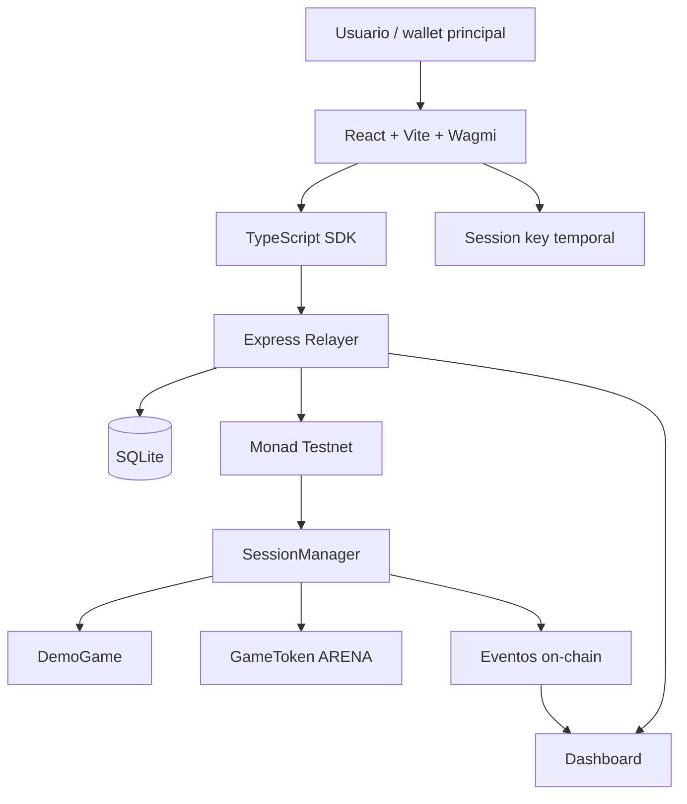

# Architecture Overview — Monad Session Arena

> Nota: este documento es un resumen organizacional de arquitectura. No es una spec exhaustiva ni sustituye futuras especificaciones técnicas.

## Objetivo arquitectónico

Construir una infraestructura de session keys para una demo de gaming on-chain en Monad, priorizando UX sin sacrificar controles básicos de seguridad.

El sistema permite que un jugador autorice una session key temporal con permisos limitados para ejecutar acciones de juego mediante un relayer.

## Arquitectura de alto nivel

## Componentes

| Componente | Responsabilidad |
|---|---|
| Frontend | UX, wallet connection, juego, dashboard |
| SDK | Session key, typed data, firmas, cliente relayer |
| Relayer | Recibir acciones firmadas, simular, enviar tx, guardar historial |
| SQLite | Persistir sesiones, acciones, txs y eventos para dashboard |
| SessionManager | Validación on-chain de permisos, nonces, expiración, spend limit y revocación |
| DemoGame | Contrato de juego compatible con ejecución directa |
| GameToken | ERC-20 mock para gasto controlado |

## Modelo de confianza

El sistema no debe confiar en el frontend ni en el relayer para seguridad crítica.

Validaciones que deben ocurrir on-chain:

- firma válida del owner para crear sesión,
- firma válida de session key para ejecutar acción,
- nonce correcto,
- sesión no expirada,
- sesión no revocada,
- acción permitida,
- límite de acciones,
- límite de gasto ERC-20.

El relayer puede mejorar UX, simular y filtrar errores, pero no debe ser una fuente de seguridad.

## Modelo de ejecución directa

El proyecto usa ejecución directa, no ERC-2771.

Esto significa que `SessionManager` ejecuta acciones contra `DemoGame`, y `DemoGame` debe ser compatible con este patrón. El usuario real se identifica mediante el `owner` validado por `SessionManager`, no mediante `msg.sender` dentro de `DemoGame`.

Ventajas:

- simple,
- auditable,
- adecuado para hackathon,
- evita complejidad de account abstraction,
- buen control de permisos.

Limitaciones:

- no funciona automáticamente con cualquier contrato existente,
- las dApps deben integrarse con el patrón,
- en fases posteriores conviene evaluar ERC-2771 o smart accounts.

## Flujo resumido

1. Frontend genera session key temporal.
2. Usuario firma session grant con su wallet principal.
3. Relayer registra o envía la creación de sesión.
4. Usuario juega en frontend.
5. Session key firma cada acción.
6. Relayer envía la acción a Monad testnet.
7. `SessionManager` valida permisos.
8. `SessionManager` ejecuta acción en `DemoGame`.
9. Eventos se guardan y muestran en dashboard.
10. Usuario puede revocar sesión.

## Reglas de seguridad principales

- Nonce secuencial por sesión.
- Expiración obligatoria.
- Revocación inmediata.
- No wildcards de acciones en hackathon.
- Spend limit ERC-20 simple y explícito.
- Session key con duración corta.
- Eventos para trazabilidad.

## Evolución futura

Posibles extensiones:

- ERC-2771 formal.
- Smart accounts.
- EIP-1271.
- ERC-4337 si el ecosistema Monad lo justifica.
- Nonce lanes.
- Policy modules.
- Validators avanzados de calldata.
- Multi-relayer.
- Indexación con Ponder o Envio.
