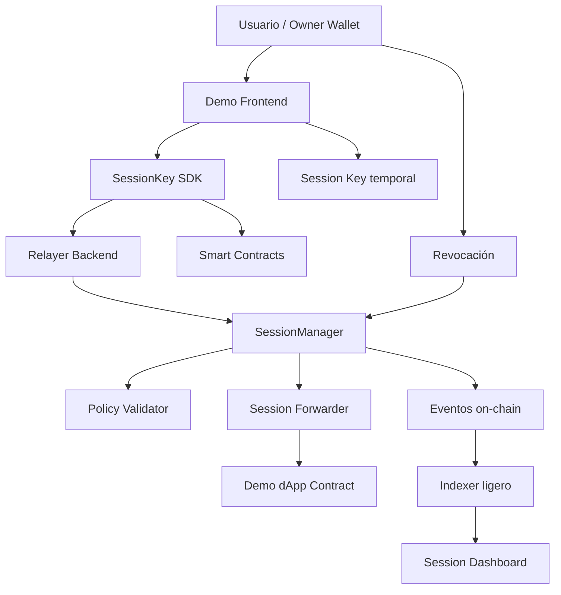

# 1. Evaluación de factibilidad

## Veredicto

**Factible si el alcance se controla bien.**

En 6 días se puede construir:

- Contratos core de session keys.
- EIP-712 para autorización.
- Session key temporal.
- Permisos por contrato.
- Permisos por función.
- Límites por duración.
- Límites por cantidad de transacciones.
- Límite de valor nativo.
- Revocación individual.
- Revocación global por epoch.
- Relayer backend en TypeScript.
- SDK básico para dApps.
- Demo frontend.
- Demo dApp, idealmente gaming o social.
- Indexación ligera por eventos.
- Testing con Foundry.
- Fuzzing básico.
- Invariants principales.
- Dashboard simple de sesiones.

No intentaría en 6 días:

- ERC-4337 completo.
- Paymasters productivos.
- Smart accounts universales.
- Soporte para cualquier contrato arbitrario.
- Calldata validators complejos para trading.
- Integración con múltiples wallets avanzadas.
- Auditoría formal.
- Infra relayer altamente disponible.
- Multi-relayer descentralizado.
- Indexer productivo complejo.

---

# 2. Nivel recomendado para 6 días

Yo apuntaría a una versión entre MVP e intermedia:

## `Monad SessionKey Kit v0.1`

Una infraestructura reusable con:

1. `SessionManager`
2. `SessionForwarder`
3. `PolicyValidator`
4. `Relayer`
5. `TypeScript SDK`
6. `React demo`
7. `Demo dApp`
8. `Event indexer ligero`
9. `Tests + fuzzing + invariants básicos`

---

# 3. Qué arquitectura sí haría en 6 días

## Decisión estratégica principal

Usaría una arquitectura de **account abstraction parcial**, no completa.

Es decir:

- No usaría ERC-4337 como base.
- No haría smart accounts universales desde el inicio.
- Sí haría session keys con permisos y ejecución delegada.
- Sí prepararía el diseño para poder migrar luego a smart accounts.

---

## Arquitectura recomendada



---

# 4. Alcance técnico recomendado

## Contratos

### 1. `SessionManager.sol`

Responsable de:

- Crear sesiones.
- Validar firma del owner.
- Guardar estado mínimo de la sesión.
- Validar expiración.
- Validar revocación.
- Validar nonce.
- Validar límites de uso.
- Ejecutar acciones autorizadas.
- Emitir eventos.

Funciones principales:

```text
createSession()
executeWithSession()
revokeSession()
revokeAllSessions()
getSessionState()
```

---

### 2. `SessionTypes.sol`

Responsable de definir structs compartidos:

```text
SessionPolicy
Permission
SessionCall
SessionState
```

---

### 3. `SessionEIP712.sol`

Responsable de:

- Domain separator.
- Hash de autorización de sesión.
- Hash de acción.
- Hash de revocación.

Separarlo ayuda a mantener limpio el contrato principal.

---

### 4. `PolicyValidator.sol`

Responsable de validar:

- Target permitido.
- Selector permitido.
- Valor permitido.
- Max calls.
- Duración.
- Rate limit básico, si entra en alcance.

Para 6 días, lo haría interno o como librería. No haría aún un sistema de módulos externos demasiado dinámico.

---

### 5. `SessionForwarder.sol`

Responsable de ejecutar llamadas hacia contratos compatibles.

En esta versión haría un modelo tipo ERC-2771 simplificado:

- La dApp demo debe confiar en el forwarder.
- La dApp puede recuperar el `session owner`.
- El sistema no pretende funcionar con cualquier contrato legacy.

---

### 6. `DemoGame.sol` o `DemoSocial.sol`

Contrato para demostrar valor.

Recomiendo `DemoGame.sol` porque el caso de uso se entiende muy rápido:

- `move(uint8 direction)`
- `collect(uint256 itemId)`
- `attack(uint256 enemyId)`
- Ranking o contador de acciones.

---

## Backend / relayer

### `relayer`

Responsable de:

- Recibir acciones firmadas por session key.
- Validar formato.
- Simular transacción.
- Enviar transacción a Monad.
- Devolver `txHash`.
- Guardar logs básicos.
- Aplicar rate limits simples.
- Exponer estado de sesión.

Endpoints recomendados:

```text
POST /session/register
POST /session/execute
POST /session/revoke
GET  /session/:sessionId
GET  /owner/:address/sessions
GET  /health
```

Para 6 días, usaría:

- Node.js.
- TypeScript.
- Fastify.
- Viem.
- SQLite o Postgres local.
- Redis solo si el equipo ya lo domina.

---

## SDK

### `@monad-session/sdk`

Responsable de:

- Generar session key.
- Construir políticas.
- Solicitar firma EIP-712 al owner.
- Firmar acciones con session key.
- Enviar acciones al relayer.
- Revocar sesiones.
- Leer estado.

API tentativa:

```text
createSession()
executeAction()
revokeSession()
getSessionStatus()
buildPolicy()
signSessionCall()
```

No escribiría todavía la spec de la API, pero sí definiría estos nombres como guía.

---

## Frontend demo

Pantallas mínimas:

1. Connect wallet.
2. Create session.
3. Permission preview.
4. Execute actions without wallet popups.
5. Session status.
6. Revoke session.
7. Unauthorized action test.
8. Event/activity log.

---

## Indexación y observabilidad

Para 6 días, haría indexación ligera:

- Listener de eventos con `viem`.
- Guardado en SQLite/Postgres.
- Dashboard simple.

Eventos importantes:

```text
SessionCreated
SessionExecuted
SessionRevoked
AllSessionsRevoked
SessionExecutionFailed
```

No usaría The Graph como dependencia principal para la hackathon, salvo que el equipo ya lo tenga listo.

---

# 5. Estructura propuesta del proyecto

Sin escribir specs ni código todavía, esta sería la estructura organizacional:

```text
monad-sessionkey-kit/
  README.md
  package.json
  pnpm-workspace.yaml
  foundry.toml

  docs/
    architecture/
      overview.md
      threat-model-outline.md
      execution-model.md
      integration-guide-outline.md

    planning/
      roadmap-6-days.md
      scope.md
      demo-script.md

  specs/
    drafts/
      00-product-boundaries.md
      01-session-lifecycle.md
      02-permission-model.md
      03-eip712-signatures.md
      04-nonce-and-replay.md
      05-relayer-behavior.md
      06-sdk-interface.md
      07-observability.md

  packages/
    contracts/
      src/
        SessionManager.sol
        SessionTypes.sol
        SessionEIP712.sol
        SessionErrors.sol
        SessionEvents.sol
        PolicyValidator.sol
        SessionForwarder.sol
        examples/
          DemoGame.sol
          DemoSocial.sol

      test/
        unit/
        fuzz/
        invariant/

      script/
        DeploySessionKit.s.sol
        DeployDemo.s.sol

    sdk/
      src/
        client/
        policy/
        session/
        signer/
        relayer/
        types/
      test/

    shared/
      src/
        types/
        constants/
        abis/

  apps/
    relayer/
      src/
        api/
        chain/
        config/
        db/
        middleware/
        services/
        observability/

    demo-frontend/
      src/
        components/
        hooks/
        pages/
        lib/
        styles/

    indexer/
      src/
        listeners/
        db/
        processors/

    dashboard/
      src/

  infra/
    docker/
    env/
    scripts/

  audits/
    notes/
    slither/
    gas-reports/

  scripts/
    deploy/
    demo/
    load-test/
```

---

# 6. Skills pertinentes

No veo necesario invocar una skill externa aquí porque la única skill disponible en el entorno es para **crear skills de agente**, y tu pedido no es crear una skill de Zed.

Pero sí identifico las **capacidades técnicas o “skills” del equipo** que deberían cubrirse:

| Área | Skill necesaria | Prioridad |
|---|---|---:|
| Smart contracts | Solidity, EIP-712, seguridad, Foundry | Alta |
| Backend Web3 | Node.js, TypeScript, Viem, relayers | Alta |
| Frontend Web3 | React, wagmi, wallet UX, typed data signing | Alta |
| Seguridad | Replay protection, nonces, permisos, fuzzing | Alta |
| DevOps ligero | Deploy scripts, env management, logs | Media |
| Product/demo | Narrativa, demo flow, UX de permisos | Alta |
| Indexación | Eventos, listeners, dashboard | Media |

Si el equipo es pequeño, idealmente dividiría así:

## Equipo de 2 personas

| Persona | Responsabilidad |
|---|---|
| Dev 1 | Contratos, tests, deploy |
| Dev 2 | Relayer, SDK, frontend demo |

## Equipo de 3 personas

| Persona | Responsabilidad |
|---|---|
| Dev 1 | Contratos + tests |
| Dev 2 | Relayer + SDK |
| Dev 3 | Frontend + demo + dashboard |

## Equipo de 4 personas

| Persona | Responsabilidad |
|---|---|
| Dev 1 | Contratos |
| Dev 2 | Testing/security/deploy |
| Dev 3 | Relayer/SDK |
| Dev 4 | Frontend/demo/indexer |

---

# 7. Programación general de desarrollo en 6 fases

## Phase 0 / Preparación previa

Objetivo: cerrar alcance.

Entregables:

- Decidir demo principal.
- Confirmar red Monad a usar.
- Confirmar RPC, explorer y faucet.
- Definir contratos exactos.
- Definir permisos soportados.
- Definir qué queda fuera.
- Crear repositorio y estructura.
- Configurar monorepo.

Decisiones que deben quedar cerradas:

```text
¿Demo gaming o social?
¿ERC-2771 simplificado o ejecución directa?
¿Relayer obligatorio o fallback directo?
¿SQLite/Postgres o solo memoria?
¿Se usará pnpm?
¿Foundry solamente o Foundry + Hardhat?
```

Mi recomendación:

- Demo gaming.
- Foundry.
- TypeScript + Viem.
- Fastify.
- React + Vite.
- Relayer obligatorio para demo.
- Fallback directo opcional.
- SQLite o memoria persistida en JSON para hackathon.

---

## Phase 1 — Contratos base y modelo de sesión

Objetivo: tener la base on-chain.

Trabajo:

- Definir structs.
- Definir errores.
- Definir eventos.
- Implementar hashing EIP-712.
- Implementar creación de sesión.
- Implementar storage mínimo.
- Implementar revocación individual.
- Implementar expiración.

Entregables:

- `SessionTypes`.
- `SessionEIP712`.
- `SessionManager` parcial.
- Tests unitarios de:
  - creación válida,
  - firma inválida,
  - expiración,
  - revocación.

Criterio de éxito:

> Se puede crear una sesión firmada por el owner y luego revocarla.

---

## Phase 2 — Ejecución, permisos y demo contract

Objetivo: ejecutar acciones autorizadas.

Trabajo:

- Implementar `executeWithSession`.
- Validar nonce secuencial.
- Validar target permitido.
- Validar selector permitido.
- Validar `maxCalls`.
- Validar `maxNativeSpend`, si aplica.
- Crear `DemoGame`.
- Añadir eventos de ejecución.
- Añadir tests de replay attack.

Entregables:

- Acción ejecutable con session key.
- Demo contract funcional.
- Tests para:
  - replay,
  - selector no permitido,
  - target no permitido,
  - max calls,
  - sesión revocada.

Criterio de éxito:

> Una session key puede ejecutar `DemoGame.move()` sin usar la wallet principal.

---

## Phase 3 — Relayer y SDK inicial

Objetivo: conectar off-chain con on-chain.

Trabajo backend:

- Crear relayer Fastify.
- Configurar wallet del relayer.
- Endpoint `/execute`.
- Simulación previa.
- Envío de transacción.
- Manejo de errores.
- Logs.

Trabajo SDK:

- Generar session key.
- Crear typed data.
- Firmar autorización.
- Firmar acción.
- Enviar acción al relayer.

Entregables:

- `apps/relayer`.
- `packages/sdk`.
- Prueba end-to-end básica desde script.

Criterio de éxito:

> Un script TypeScript crea sesión y ejecuta una acción a través del relayer.

---

## Phase 4 — Frontend demo e integración completa

Objetivo: tener demo usable.

Trabajo:

- Conectar wallet.
- Crear session key desde UI.
- Mostrar modal de permisos.
- Firmar autorización.
- Ejecutar acciones de juego.
- Mostrar nonce/calls restantes.
- Botón de revocación.
- Mostrar errores legibles.

Entregables:

- `demo-frontend`.
- Flujo completo:
  - connect,
  - create session,
  - play,
  - revoke,
  - failed action after revoke.

Criterio de éxito:

> Un usuario puede probar la experiencia sin leer la consola.

---

## Phase 5 — Seguridad, observabilidad y pulido

Objetivo: hacer el sistema defendible ante jurado técnico.

Trabajo:

- Fuzzing básico.
- Invariant tests.
- Slither.
- Gas report.
- Indexer ligero de eventos.
- Dashboard simple o panel de actividad.
- Mejorar errores.
- Mejorar UI de permisos.
- Preparar demo script.
- Añadir documentación de arquitectura.

Entregables:

- Tests reforzados.
- Reporte de gas.
- Logs de eventos.
- Dashboard de sesiones.
- Documento corto de threat model.

Criterio de éxito:

> El proyecto no solo funciona, también se puede defender técnicamente.

---

## Phase 6 — Ensayo, hardening final y presentación

Objetivo: reducir riesgo de demo failure.

Trabajo:

- Deploy final.
- Probar en Monad testnet.
- Grabar video de fallback.
- Ensayar demo.
- Preparar slides.
- Documentar cómo correr localmente.
- Congelar features.
- Solo bugfixes.

Entregables:

- Demo estable.
- README claro.
- Pitch deck.
- Video corto.
- Contratos desplegados.
- Link al frontend.
- Script de demo.

Criterio de éxito:

> El equipo puede hacer la demo completa en menos de 4 minutos.

---

# 8. Roadmap por versiones

## MVP extendido — 6 fases

Incluye:

- EIP-712 session grant.
- EIP-712 session call.
- Session key temporal.
- Revocación individual.
- Revocación global por epoch, si hay tiempo.
- Nonce secuencial.
- Target whitelist.
- Function selector whitelist.
- Expiración.
- Max calls.
- Relayer.
- SDK básico.
- Demo app.
- Tests.
- Dashboard simple.

---

## Versión intermedia

Incluye:

- ERC-2771 más formal.
- SDK publicado como paquete.
- React hooks.
- Policy templates.
- Nonce lanes.
- Rate limiting on-chain más flexible.
- Indexer con Ponder o Envio.
- Dashboard completo.
- Multi-dApp support.
- Validators para calldata.
- ERC-20 spend limits.
- EIP-1271 para smart contract wallets.

---

## Versión avanzada

Incluye:

- Smart accounts.
- ERC-4337 opcional.
- Paymaster.
- Multi-relayer.
- Policy marketplace.
- Session key recovery.
- Passkey integration.
- Secure enclave/mobile.
- Formal verification parcial.
- Auditoría externa.

---

# 9. Decisiones técnicas recomendadas para 6 días

## Foundry vs Hardhat

Recomendación: **Foundry principal**.

| Opción | Uso recomendado |
|---|---|
| Foundry | Contratos, tests, fuzzing, deploy scripts |
| Hardhat | Solo si el equipo ya tiene scripts existentes |
| Ambos | Posible, pero puede duplicar complejidad |

Para 6 días, no metería ambos salvo necesidad real.

---

## Viem vs Ethers

Recomendación: **Viem**.

Motivos:

- Mejor tipado TypeScript.
- Buen manejo de EIP-712.
- Buen encaje con wagmi.
- API moderna.
- Ideal para SDK.

Ethers también sirve, pero para SDK moderno usaría Viem.

---

## Fastify vs Express

Recomendación: **Fastify**.

Motivos:

- Rápido.
- Buen TypeScript.
- Plugins limpios.
- Mejor estructura para API.

Express es más conocido, pero menos estricto.

---

## SQLite/Postgres/Redis

Para 6 días:

- Si quieren simplicidad: memoria + logs.
- Si quieren dashboard: SQLite.
- Si ya dominan Docker: Postgres.

Mi recomendación:

> SQLite para sesiones y eventos del relayer. Suficiente para hackathon.

No usaría Redis salvo que haga falta rate limiting más serio.

---

## Indexer

Para 6 días:

- Listener con Viem.

No metería The Graph salvo que sea requisito o el equipo lo domine.

---

## Smart accounts

Para 6 días:

- No como base.
- Sí mencionar como evolución.

Si intentan meter smart accounts en el core, el riesgo de retraso sube mucho.

---

## ERC-2771

Para 6 días:

- Usaría un modelo inspirado en ERC-2771.
- No intentaría compatibilidad universal perfecta.
- Haría que la demo dApp soporte `trustedForwarder`.

Esto es un buen balance entre utilidad real y alcance controlado.

---

# 10. Alcance de permisos recomendado

## Para hackathon

Soportar:

| Restricción | Incluir |
|---|---:|
| Por contrato target | Sí |
| Por selector de función | Sí |
| Por duración | Sí |
| Por número máximo de llamadas | Sí |
| Por nonce | Sí |
| Revocación | Sí |
| Valor nativo máximo | Sí, simple |
| Rate limit | Opcional |
| ERC-20 spend limit | No o muy simple |
| Calldata constraints avanzados | No |
| Trading constraints | No |

---

## Formato conceptual de una policy

Sin escribir código, conceptualmente:

```text
SessionPolicy
- owner
- sessionKey
- validAfter
- validUntil
- maxCalls
- maxNativeSpend
- allowedTargets[]
- allowedSelectors[]
- salt
- ownerEpoch
```

Para 6 días, evitaría policies muy expresivas. Mejor una policy simple, segura y demostrable.

---

# 11. Testing mínimo necesario

## Tests unitarios

Imprescindibles:

- Crear sesión válida.
- Rechazar firma inválida.
- Rechazar sesión expirada.
- Rechazar sesión revocada.
- Rechazar nonce incorrecto.
- Rechazar replay.
- Rechazar target no permitido.
- Rechazar selector no permitido.
- Rechazar max calls excedido.
- Ejecutar acción válida.

---

## Fuzzing

Fuzz mínimo:

- Nonces aleatorios.
- Timestamps.
- Targets.
- Selectors.
- Values.
- Expiraciones.

---

## Invariants

Invariantes clave:

```text
Una sesión revocada nunca ejecuta.
Una sesión expirada nunca ejecuta.
Un nonce no se puede usar dos veces.
callCount no puede superar maxCalls.
Una función no permitida nunca llega al contrato destino.
Una firma de otra chain no sirve.
Una firma de otro contrato verificador no sirve.
```

---

# 12. Observabilidad y trazabilidad

Para que el jurado lo vea como infraestructura real, no solo contratos, incluiría:

## Eventos on-chain

```text
SessionCreated
SessionExecuted
SessionRevoked
AllSessionsRevoked
SessionExecutionFailed
```

## Dashboard simple

Mostrar:

- Owner.
- Session key.
- Estado.
- Expiración.
- Calls usadas.
- Calls restantes.
- Últimas acciones.
- Nonce actual.
- Revoked: true/false.

## Logs del relayer

Mostrar:

- Acción recibida.
- Simulación exitosa/fallida.
- Tx enviada.
- Hash.
- Error si falla.
- Latencia aproximada.

---

# 13. Demo recomendada

## Demo principal: mini juego on-chain

Nombre posible:

**Monad Session Arena**

Flujo:

1. Usuario conecta wallet.
2. Crea sesión por 5 minutos.
3. Permisos visibles:
   - solo `DemoGame.move`,
   - solo `DemoGame.collect`,
   - máximo 30 acciones,
   - cero gasto nativo.
4. Firma una vez.
5. Ejecuta movimientos rápidos sin popups.
6. El dashboard muestra las acciones.
7. Intenta usar una función no autorizada.
8. Falla.
9. Revoca sesión.
10. Intenta mover otra vez.
11. Falla.

Mensaje para jurado:

> “Monad permite muchas acciones on-chain rápidas. Nuestro kit hace que esas acciones sean usables y seguras mediante session keys con permisos limitados.”

---

# 14. Riesgos del plan de 6 fases

## Riesgo 1: querer hacer demasiado

Mayor riesgo.

Mitigación:

- Congelar alcance en la Phase 1.
- No meter ERC-4337.
- No meter trading.
- No meter validators complejos.

---

## Riesgo 2: problemas con EIP-712

EIP-712 suele consumir tiempo por errores de hashing.

Mitigación:

- Hacer tests desde el primer día.
- Usar OpenZeppelin.
- Validar firmas con scripts TypeScript temprano.
- No dejar integración frontend para el final.

---

## Riesgo 3: UX de permisos confusa

Si la UI no explica qué se autoriza, el proyecto parece inseguro.

Mitigación:

- Crear modal de permisos desde la Phase 4.
- Mostrar lenguaje humano, no solo hashes.

---

## Riesgo 4: relayer inestable

Mitigación:

- Endpoint mínimo.
- Simulación previa.
- Logs claros.
- Fallback manual si es posible.
- Video de backup.

---

## Riesgo 5: contratos demasiado genéricos

Mitigación:

- Restricciones simples.
- Demo dApp compatible.
- No pretender soportar todos los contratos EVM.

---

# 15. Siguiente paso recomendado

Antes de escribir specs o código, haría esta secuencia:

## Paso 1: cerrar scope exacto

Responder estas preguntas:

1. ¿El demo será gaming, social o micropagos?
2. ¿Cuántas personas hay en el equipo?
3. ¿Qué experiencia tiene el equipo con Solidity, Foundry y TypeScript?
4. ¿La demo se hará en Monad testnet?
5. ¿Quieren relayer obligatorio o fallback directo?
6. ¿Quieren dashboard o solo logs?
7. ¿El objetivo principal es ganar por UX, infraestructura o seguridad?

---

## Paso 2: definir backlog

Crear issues/tareas, no specs largas todavía.

Ejemplo:

```text
CONTRACT-01 Define session structs
CONTRACT-02 Implement EIP-712 session grant
CONTRACT-03 Implement createSession
CONTRACT-04 Implement executeWithSession
CONTRACT-05 Implement revokeSession
RELAYER-01 Setup Fastify server
RELAYER-02 Implement execute endpoint
SDK-01 Build typed data helpers
SDK-02 Implement session key generation
FRONTEND-01 Wallet connection
FRONTEND-02 Create session modal
DEMO-01 Implement game board
SECURITY-01 Replay tests
SECURITY-02 Revocation tests
```

---

## Paso 3: acordar arquitectura final

Mi recomendación final para arquitectura de 6 días:

```text
Solidity contracts:
- SessionManager
- SessionEIP712
- PolicyValidator
- SessionForwarder
- DemoGame

Backend:
- Fastify relayer
- Viem client
- SQLite logs

SDK:
- TypeScript
- Viem
- EIP-712 helpers
- Session client

Frontend:
- React + Vite
- Wagmi
- Viem
- Simple dashboard

Testing:
- Foundry
- Unit tests
- Fuzzing
- Invariants básicos
- Slither
```

---

# 16. Recomendación final

Sí, con 6 días conviene subir el alcance desde MVP mínimo a una **versión intermedia avanzada**, pero manteniendo una regla:

> Completo no significa universal. Completo significa seguro, coherente, integrado y demoable.

La versión más fuerte para presentar sería:

## `Monad SessionKey Kit`

Con una demo de gaming/social que pruebe:

- una sola firma inicial,
- múltiples acciones rápidas en Monad,
- session key temporal,
- permisos limitados,
- validación on-chain,
- relayer,
- revocación inmediata,
- replay protection,
- trazabilidad por eventos,
- SDK básico para developers.

Ese alcance es suficientemente ambicioso para una hackathon de 6 días, pero todavía realista.
