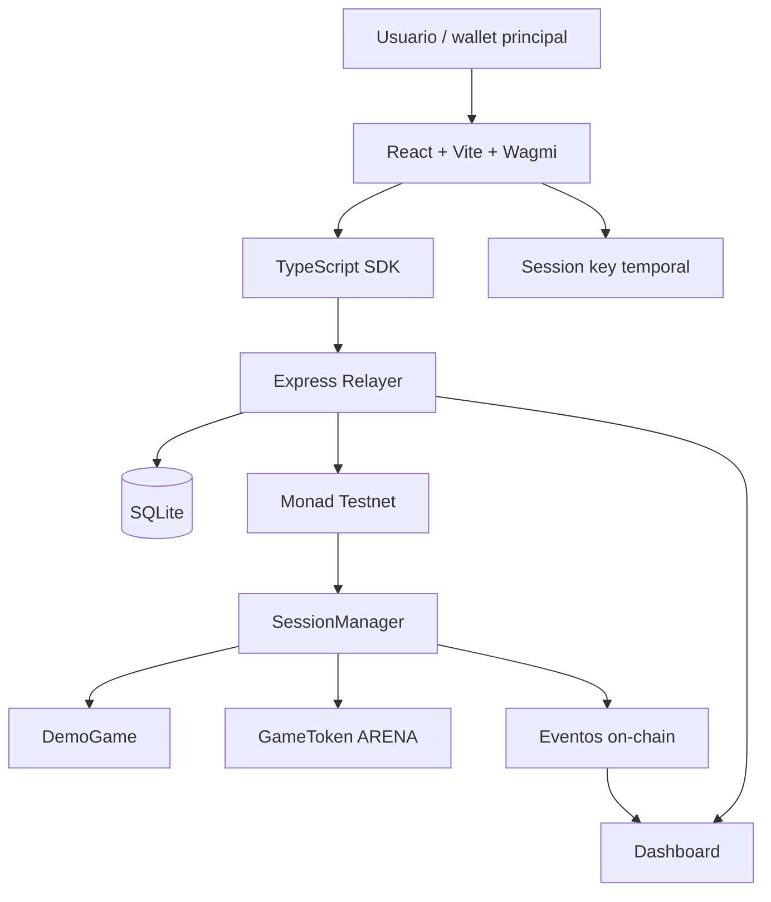

# System Architecture Spec — Monad Session Arena

## Metadata

| Campo | Valor |
|---|---|
| Spec ID | `ARCH-SYSTEM-001` |
| Estado | `Ready` |
| Prioridad | `P0` |
| Fecha | `2026-06-02` |
| Responsable | Equipo completo |

## Objetivo

Definir la arquitectura del sistema para construir una demo funcional de session keys en Monad con foco en UX, seguridad mínima sólida y ejecución rápida.

## Componentes

| Componente | Ubicación | Responsabilidad |
|---|---|---|
| `SessionManager` | `packages/contracts` | Crear sesiones, validar permisos, ejecutar acciones y revocar |
| `DemoGame` | `packages/contracts` | Juego compatible con ejecución directa |
| `GameToken` | `packages/contracts` | ERC-20 mock `ARENA` |
| Relayer | `apps/relayer` | Recibir acciones, simular, enviar tx y guardar historial |
| SDK | `packages/sdk` | Generar session key, firmar typed data, llamar relayer |
| Shared | `packages/shared` | Tipos, ABIs y direcciones compartidas |
| Frontend | `apps/frontend` | UX del juego, wallet, permisos y dashboard |
| SQLite | `apps/relayer/db` | Persistencia local de sesiones, acciones y txs |

## Modelo de ejecución

El proyecto usa **ejecución directa**.

```text
Session key firma acción
→ relayer envía tx
→ SessionManager valida
→ SessionManager llama DemoGame
→ DemoGame actualiza estado del owner
```

`DemoGame` no debe asumir que `msg.sender` es el jugador. El jugador real será el `owner` validado por `SessionManager`.

## Modelo de confianza

El frontend y el relayer no son confiables para seguridad crítica.

Validaciones obligatorias on-chain:

- firma del owner al crear sesión,
- firma de session key al ejecutar acción,
- nonce,
- expiración,
- revocación,
- acción permitida,
- límite de acciones,
- límite de gasto ERC-20.

El relayer puede:

- simular,
- filtrar requests inválidos,
- guardar logs,
- mejorar UX.

El relayer no puede:

- cambiar la acción firmada,
- saltarse permisos,
- ejecutar después de revocación,
- modificar el owner,
- exceder spend limit.

## Flujo principal

```text
1. Frontend genera session key temporal.
2. Usuario firma SessionGrant con wallet principal.
3. Relayer registra la sesión on-chain.
4. Usuario ejecuta acción en frontend.
5. SDK firma SessionAction con session key.
6. Relayer recibe la acción firmada.
7. Relayer simula tx.
8. Relayer envía tx a Monad testnet.
9. SessionManager valida.
10. DemoGame actualiza estado.
11. Eventos se muestran en dashboard.
```

## Diagrama



## Almacenamiento on-chain

`SessionManager` debe guardar el estado mínimo necesario:

- owner,
- session key,
- expiración,
- nonce actual,
- llamadas usadas,
- gasto usado,
- revoked,
- hash o representación compacta de permisos.

Evitar para hackathon:

- arrays dinámicos complejos,
- compatibilidad universal con targets arbitrarios,
- mappings innecesariamente profundos,
- contadores globales que no aporten al demo.

## Almacenamiento off-chain

SQLite debe guardar datos para dashboard:

- sesiones registradas,
- acciones enviadas,
- tx hashes,
- errores,
- timestamps,
- estado visible.

SQLite no es fuente de seguridad.

## Decisiones técnicas

| Decisión | Valor |
|---|---|
| Red | Monad testnet |
| Contratos | Solidity + Foundry |
| Backend | TypeScript + Express + Viem |
| DB | SQLite |
| Frontend | React + Vite + Wagmi + Tailwind |
| Relayer | Obligatorio |
| Ejecución | Directa |
| ERC-2771 | No en hackathon |
| ERC-4337 | No en hackathon |

## Criterios de aceptación

- [ ] Existe una ruta clara desde frontend hasta contrato y dashboard.
- [ ] El relayer no es una autoridad de seguridad.
- [ ] `DemoGame` identifica jugadores por `owner`, no por `msg.sender`.
- [ ] La arquitectura permite implementar el vertical slice `MOVE` primero.
- [ ] El diseño puede extenderse en fases posteriores hacia ERC-2771 o smart accounts.

## Riesgos

| Riesgo | Mitigación |
|---|---|
| Ejecución directa limita compatibilidad | Aceptado para demo; en fases posteriores evaluar ERC-2771 |
| Relayer centralizado | Aceptado para demo; validación crítica on-chain |
| SQLite inconsistente | No usar SQLite como fuente de verdad |
| Demasiadas features | Priorizar vertical slice `MOVE` |
